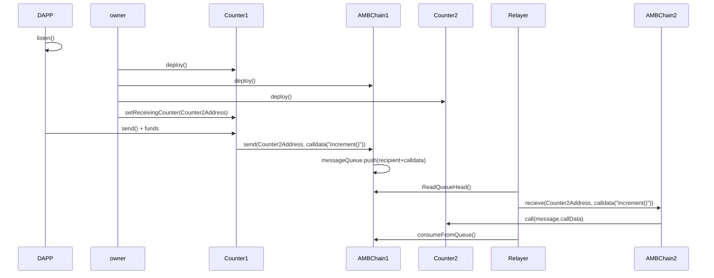

# AMBCC - Arbitrary Message Bridge for Cross-Chain communication

## E2E testing on multiple contracts on Goreli

### 1. Set up a .env file with:
```bash
API_KEY=<Infura-API-Key>
PRIV_KEY1=<Relayer-Private-Key>
PRIV_KEY2=<Message-Sender-DAPP-Private-Key>
```
### 2. Run the following commands:
```bash
$ npm install
$ npx hardhat test
```

## AMB
- We developed a simple AMB that allows you to send arbitrary encoded commands cross-chain.
- For example you can do the following to exectute a function on a contract at as targetAddress:
```solidity
        AMB.send(targetAddress, abi.encodeWithSignature("targetFunc()", "arg1", arg2"...));

```

## Simple Example of an Incrementable Counter
- To showcase use of the simple AMB, we create a counter contract that allows you send message to increment a smart-contract on a corresponding chain.

## Sequence Diagram of smart-contract/service interactions

